# Credit_Risk_Analysis

## Overview of analysis

The goal of this project is to use surpervised machine learning to create a model that can predict whether or not LendingClub loans will be repaid.

### Purpose

In this project, 2019 loan data was imported and transformed to provide useful numerical data. Then the target class (loan status) was split from the rest of the data. Additionally, in order to improve the class imbalance the data was
prepared using naive oversampling, SMOTE oversampling, undersampling, and combination over and under sampling using SMOTEEN. Logistic regression was performed on all of these data sets. Random forrest and an ensemble method called 
adaptiveboosting was used to create additional models. An accuracy score, a confusion matrix, and a classification report was generated for each of these models to determine which would be the best method of determining which loans would
be repaid. 

## Results

First the logistic regression models were created with different sampling techniques. 

Naive Oversampling Results:

- The Balanced Accuracy Score is 0.639

- Confusion Matrix

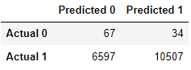

- Classification Report

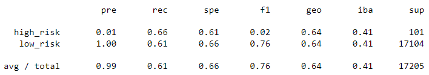

SMOTE Oversampling Results:

- The Balanced Accuracy Score is 0.663

- Confusion Matrix

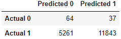

- Classification Report

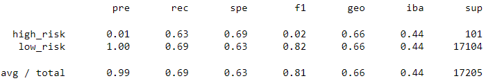

Undersampling Results:

- The Balanced Accuracy Score is 0.544

- Confusion Matrix

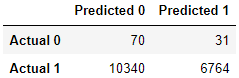

- Classification Report

Combination (Over and Under) Sampling Results:

- The Balanced Accuracy Score is 0.644

- Confusion Matrix

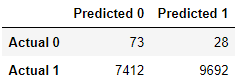

- Classification Report

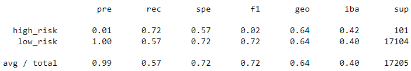

Next the ensemble models were created with the following results.
 

Random Forest Results:

- The Balanced Accuracy Score is 0.789

- Confusion Matrix

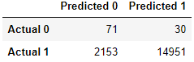

- Classification Report

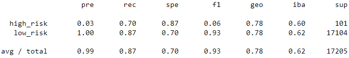

Easy Ensemble Adaboost Results:

- The Balanced Accuracy Score is 0.932

- Confusion Matrix

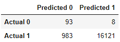

- Classification Report

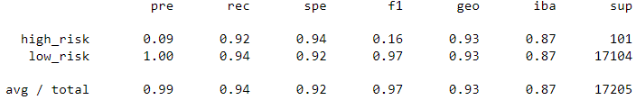

## Summary

Overall when analyzing these models it is most important to minimize losses. The reason behind this is because a single unpaid loan has the potential to wipe out the gains made on between 5 (20% interest loans) and 20 (5% interest) loans.
This implies that it is preferable to pass on potentially bad loans than it is to try to get every last loan that can be repaid. This suggests that it is crucial to maximize precision. 

Based on the precision of the models I would rank them:

	1. Easy Ensemble Adaboost
	2. Random Forrest
	3. Logistic Regression with SMOTE Oversampling
	4. Logistic Regression with Naive Oversampling
	5. Logistic Regression with SMOTEEN Combination (Over and Under) Sampling
	6. Logistic Regression with Undersampling

All of these models have precisions of well over 99%, so an argument could be made that all of these models are sufficient to the task at hand. The model that I would recommend it the easy ensemble Adaboost model, because it has a 
precision of 99.95%, but the worst of the group which is logistic regression with undersampling model, which had a 99.54% precision which would still most likely yield good results.  

