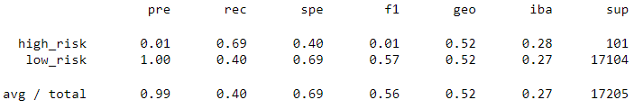

# Credit_Risk_Analysis

## Overview of analysis

The goal of this project is to use surpervised machine learning to create a model that can predict whether or not LendingClub loans will be repaid.

### Purpose

In this project, 2019 loan data was imported and transformed to provide useful numerical data. Then the target class (loan status) was split from the rest of the data. Additionally, in order to improve the class imbalance the data was
prepared using naive oversampling, SMOTE oversampling, undersampling, and combination over and under sampling using SMOTEEN. Logistic regression was performed on all of these data sets. Random forrest and an ensemble method called 
adaptiveboosting was used to create additional models. An accuracy score, a confusion matrix, and a classification report was generated for each of these models to determine which would be the best method of determining which loans would
be repaid. 

## Results

First the logistic regression models were created with different sampling techniques. 

* Naive Oversampling Results:

- The Balanced Accuracy Score is 0.639

- Confusion Matrix

- Classification Report

* SMOTE Oversampling Results:

- The Balanced Accuracy Score is 0.663

- Confusion Matrix

- Classification Report

* Undersampling Results:

- The Balanced Accuracy Score is 0.544

- Confusion Matrix

- Classification Report

* Combination (Over and Under) Sampling Results:

- The Balanced Accuracy Score is 0.644

- Confusion Matrix

- Classification Report

Next the ensemble models were created with the following results.
 

* Random Forest Results:

- The Balanced Accuracy Score is 0.789

- Confusion Matrix

- Classification Report

* Easy Ensemble Adaboost Results:

- The Balanced Accuracy Score is 0.932

- Confusion Matrix

- Classification Report

## Summary

 

